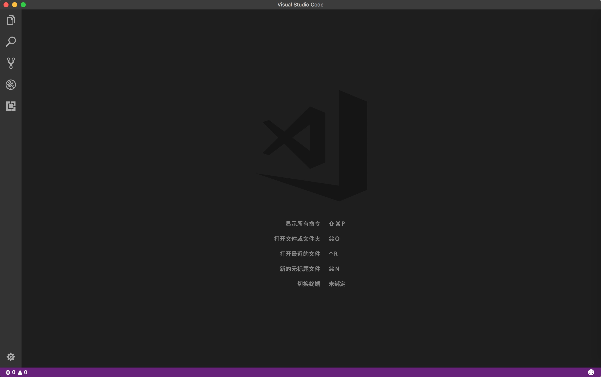
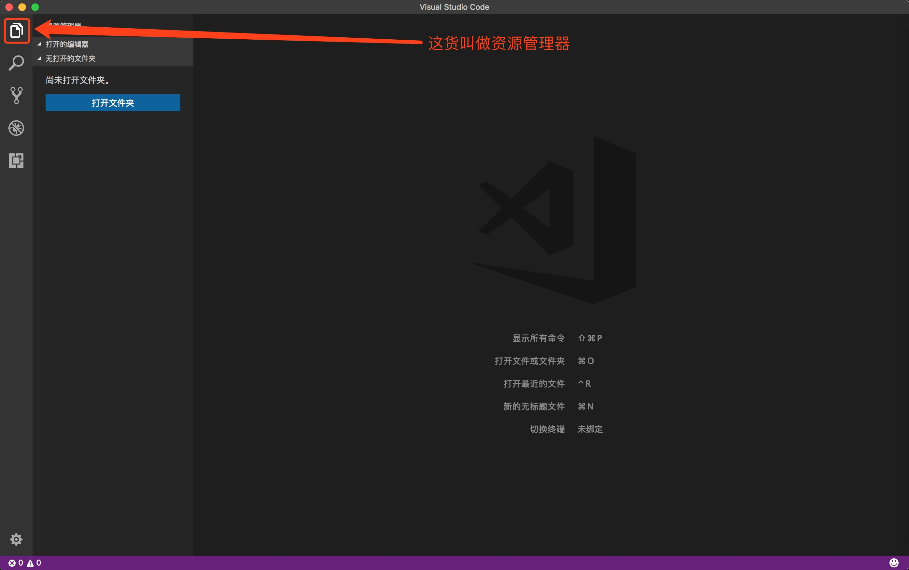
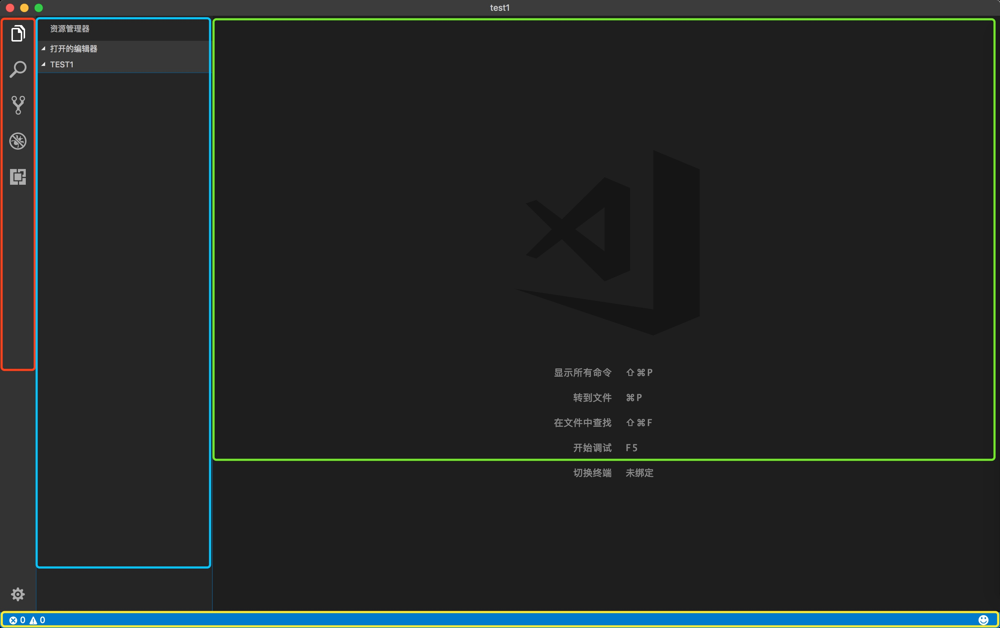
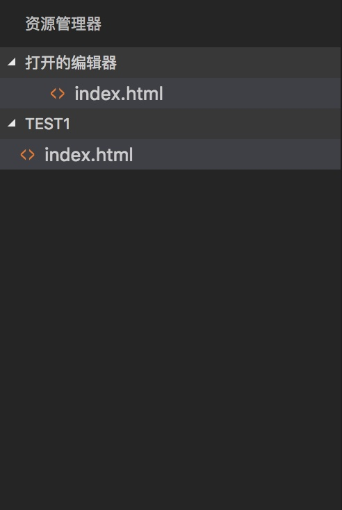

# 第一节  

IT行业是没有门槛的，这句话我一直坚信。  

没有门槛，意味着面向于所有感兴趣的人，只不过很多人找门找了很长时间，甚至是找了很长时间没有找到后就放弃了。  

入门很简单，不需要学习枯燥的C语言，数据结构，高等数学，算法，网络，硬件等，只需要你感兴趣。当你学习到一定程度后自然而然的就会对上面的“枯燥”内容感兴趣，主动去探寻了。  

这篇文章以及之后的一系列文章就是教你如何找到开发的门。  

## 知识普及  

开发，在大的层面上基本分为软件开发，硬件开发，服务器开发，通信系统，科学研究。（对于脚本来说就不吐槽了，在我看来都不算开发）  

### 软件开发  

你在日常生活中所能看到的一切在屏幕上看到的东西都叫做软件，包括你在火车站自动取票的终端机的界面，你手机开机的界面，应用，智能电视的界面等等，都叫做软件的界面，而软件的开发简单的理解就是把这些东西开发出来。  

软件开发又可以分为移动端开发，桌面端开发，网页开发。  

移动端开发指的是手机上的App的开发，包括了iOS系统中的App，Android（安卓）系统（这里指的是可以运行安卓应用的系统，包括了基于安卓系统的小米的MIUI、华为的EMUI、OPPO的ColorOS、魅族的flyme，以及可以运行安卓应用的阿里云等）中的App，甚至有的人也把微信小程序算到移动端开发中来。  

桌面端开发大家就都熟悉了，Windows系统中的应用，Mac OS系统中的应用，Linux系统中的应用（大部分都是HTML写的界面）等。  

网页开发就更常见了，基本上你每天都要用到浏览器，浏览器里面访问到的都是网页。  

### 硬件开发  

你周围几乎所有能够操作的家用电器都算是硬件，硬件的开发就是让原本的摆设机器按照使用者的操作动起来。  

### 服务器开发  

打个比方，你用微信和你的基友聊天，千里之外你们可以看的到对方发出的信息，这中间是怎样一个过程呢？你发送出去的消息首先发送到微信的服务器，微信的服务器再找到你的基友，将这条信息转发给你的基友，这样你们两个就可以互通消息了。开发这个过程就叫做服务器开发。  

服务器开发中又衍生出来了一个叫做运营维护的职位，是专门负责保证服务器正常运转的职业。  

### 通信系统开发  

这个说起来就简单了，从最早的有线电报，到有线电话，再到现在的2G，3G，4G网络，这些就叫做通信系统。这个行业和下面的科学研究一样都需要一定的专业技能。  

### 科学研究  

应用于自然科学的一些高深的高大上的东西，这些东西没有一定的基础就不用去考虑了。  

## 选择如何入门  

上面说了这么多，那我们应该如何去选择哪个方向入门呢？一般从软件开发或服务器开发开始。  

你可能会问，这两个之间只能选择一个吧？这你就大错特错了，早就已经有了横跨整个软件开发和服务器开发的利器。而我们最先选择的就是学习这个利器！  

## 开始搞事情  

### 搞事情的工具  

搞事情之前，我们手里需要有趁手的搞事情的工具。有人说不需要任何工具，vim搞定一切，emmmm......我同意这个观点，但是那都是大神才能做到的事情，小白就先老老实实找工具吧。  

开发工具数不胜数，我这里推荐使用微软出品的Visual Studio Code。这货免费还开源（至于开源是什么意思，你可以百度，要不就等我之后再说咯）。直接百度搜索Visual Studio Code找到官网就可以下载。  

  

安装完成后运行软件，界面就是上面的样子。（跟我的不一样？因为我这个是mac版）  

### 搞事情的地方  

工具到手，那么接下来就要找个地方来搞事情，搞事情也是需要天时地利的。  

在你的电脑中创建一个文件夹，文件夹的路径不要有英文之外的其他文字和特殊字符，这个文件夹将作为你搞事情的地方。  

啥叫路径？啥叫特殊字符？不知道路径和特殊字符的话，那么就这样做：  

Windows下打开我的电脑，找到随便一个盘（D、E、F都行，有个几十G的可用空间就行了），打开这个盘，然后右键新建文件夹，名字叫做“`Project`”，搞定。你创建的文件夹在你电脑中的位置就是路径，比如说`D:\Project`。  

Mac OS下直接在桌面上右键新建文件夹，名字叫做“`Project`”，也搞定。Mac下的路径就会比较长了，`/Users/用户名/Desktop/Project`。  

英文之外的其他文字和特殊字符则是指除了数字、字母、以及下划线之外的其他字符，比如说中文、日文、`!``@``#``$``%``^``&amp;``*``(``)`等。  

现在搞事情的地方也就确定好了。  

### 搞事情的范围  

在刚刚创建的“`Project`”文件夹下再创建一个文件夹，名字叫做“`test1`”也好，叫做&quot;`20180109`&quot;也行，反正你随意就好，没有中文，没有特殊字符就行。  

然后打开VSCode（即Visual Studio Code的缩写，以后就叫这个啦）。点击左侧栏的第一个叫做“资源管理器”的图标。  

  

然后点击打开文件夹，找到刚刚在“`Project`”创建的文件夹，选择并打开。  

  

#### 介绍一下界面布局结构：  

##### 红色区域  

活动栏，从上到下的图标依次是：  

* **资源管理器**：管理你开发中用到的所有文件
* **搜索**：搜索你所有文件（或指定某些文件）中的内容
* **源代码管理**：当你需要和别人一起开发一个项目的时候才会用到
* **调试**：用于调试代码，分析代码以及错误原因用的
* **扩展**：VSCode的插件，可以联网获取下载安装

##### 蓝色区域  

侧边栏，点击活动栏后展示出来的详细内容部分  

##### 绿色区域  

开发的主要区域，用于展示代码和调试代码  

##### 黄色区域  

状态栏，显示错误信息，基本信息等  

当然还有一个工具栏，因为我这边是Mac OS，工具栏统一由系统提供，所以就不在这里提了，等我换了Windows之后再来补充吧。  

### 开始搞事情  

我们做了这么多准备工作，终于要开始搞事情了。  

首先我们先学习的是网页的开发。  

网页的开发首先离不开的就是HTML，一种超文本标记语言。这么说大家可能不太理解，简单的来说呢就是给你每段想要展示的信息都标记上不同的符号，来区分不同的内容，展示不同的样子。  

估计这么说你也是一头雾水，那么我们直接上代码。  

首先点开VSCode中的资源管理器，在侧边栏中最大的空白部分右击，选择创建文件，输入文件名“`index.html`”  

  

在`index.html`中输入以下代码：  

```html
<html>
<head>
    <title>Hello World!</title>
</head>
<body>
    <div><p>这是我的第一个网页。</p></div>
</body>
</html>
```

然后用电脑的资源管理器（Mac OS中为Finder，10.13之后为“访达”）找到刚才你在“`Project`”中创建的文件夹，点击去，能够看到一个`index.html`，这个文件就是你刚刚在VSCode中创建的，双击打开，就能发现电脑打开了一个浏览器，显示了一个页面，页面中有这样一句话：  

  

> 注意：如果你的浏览器打开并不是这样一段文字，那么推荐你用Chrome浏览器打开哦  

你会发现刚刚写的一堆代码最后只展示了这一句话，那么还写这些东西有毛用呢？  

你再看看打开的页面的顶部标题，是不是变成了“`Hello World!`”了呢？  

现在可以用一句简单的话来说明标签（也可以叫做元素）：标签（元素）是以尖括号开始和结尾的，决定了内容在何位置，何时以何种方式显示的记号。大部分记号是成对出现的，结尾的尖括号中以“`/`”开始。  

对，上面的代码中`&lt;html&gt;&lt;/html&gt;`，`&lt;title&gt;&lt;/title&gt;`，`&lt;body&gt;&lt;/body&gt;`，`&lt;div&gt;&lt;/div&gt;`，`&lt;p&gt;&lt;/p&gt;`都是标签（元素）。  

不同的标签有不同的作用，通过对标签的组合我们展示出了不同样式的网页。  

有人会问，那你怎么知道哪种标签代表了什么样子呢？这个问题不用考虑的，全世界共用一个HTML标准，这个标准中规定了标签以及对应的逻辑。  

有人会说了，那是不是要背好多的标签，因为网页的展示有好多不同的样式。这就大错特错了，常用的标签就那么多，其余的都是通过互相组合来完成的。当然最新的HTML标准中允许自定义标签，那就是后话了。  

---

好了，至于具体的标签学习，以及学习HTML之后还要学习什么，就看下一篇吧。  

