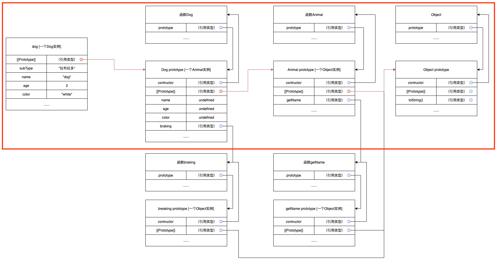
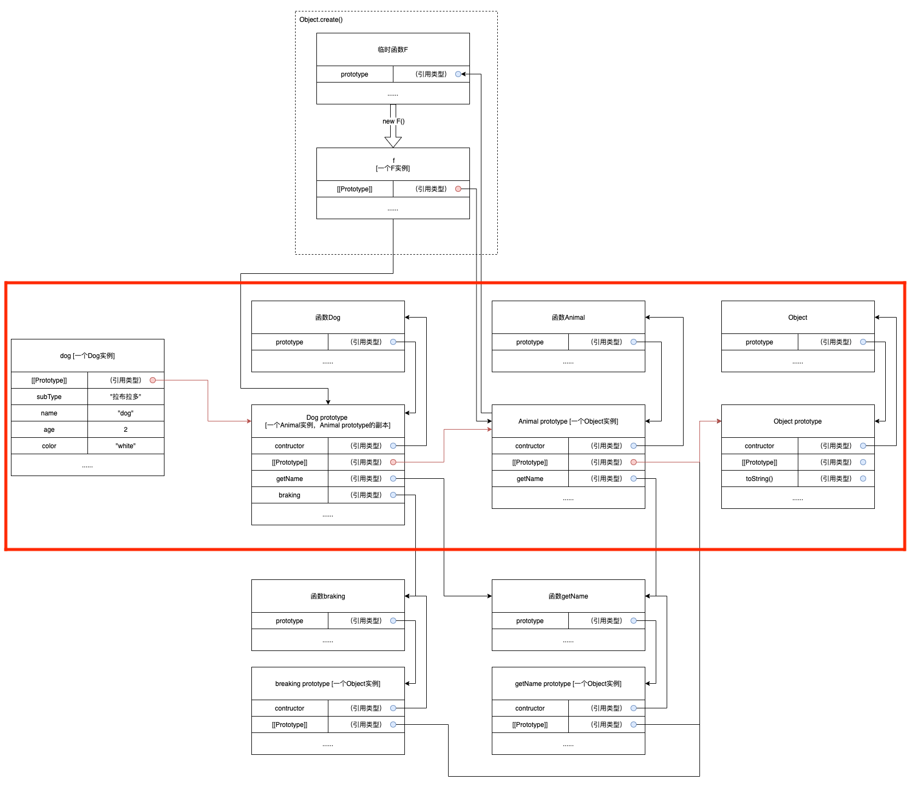

# Object详解

Object是一个引用类型。

引用类型的值是保存在内存中的对象。JavaScript不允许直接访问内存中的位置，也就是说不能直接操作对象的内存空间，在操作对象的时候，实际上是操作对象的引用而不是实际的对象。但是当给对象添加属性的时候操作的是实际的对象。

所以对于复制对象这个操作，实际上是复制了一份指向这个对象的指针。即，`var a = new Object();`，这个时候`a`只是一个指针，指向了新创建的这个对象，复制`var b = a;`，只是将`a`这个指针复制了一份给了`b`，`b`也指向了那个新创建的对象，而实际上跟新创建的那个对象没有任何关系，修改`a.name`也同样会在`b`上有所体现。


## 创建

```javascript
var 0 = new Object();
```

## 方法

### constructor

保存用于创建对象的函数。对于单纯的使用`new Objec()`创建的对象来说，`constructor`就是`Object()`。

### hasOwnProperty(propertyName: string)

用于检查给定的属性（`propertyName`）在当前的对象实例中是否存在——不检查原型链。

### isProtptypeOf(object: Object)

用于检查给定的对象是否是当前对象的原型。

### propertyIsEnumerable(propertyName: string)

用于检查给定的属性能否使用`for-in`语句进行枚举。

### toLocaleString()

返回对象的字符串表示。与执行环境的地区对应（英语区，中文区的结果与`toString()`一致）。

### toString()

返回对象的字符串表示。

### valueOf()

返回对象的字符串、数值或布尔值表示。通常与`toString()`方法的返回值相同。

## 类方法

### Object.defineProperty(object: Object, propertyName: string, options: Object)

定义对象的一个属性。对象的一个属性也有类别，可以分为两种：数据属性 和 访问器属性。

* **object**：要添加属性的目标对象。
* **propertyName**：要添加的属性的名称。
* **options**：设置数据属性（或访问器属性）的特性。

> 注意： 通过正常的点语法或者字面量方法创建一个新的属性是数据属性。

#### 数据属性

数据属性可以设置的特性主要有以下几个：

* **configurable**：能否通过`delete`删除属性从而重新定义属性，能否修改属性的特性，或者能否把属性修改为访问器属性。默认值为`true`。
* **enumerable**：能否通过`for-in`循环返回属性。默认值为`true`。
* **writable**：能否修改属性的值。默认值为`true`。
* **value**：属性值。默认值为`undefined`。

> 注意：通过正常的 点语法 或者 字面量方法 创建一个新的 数据属性 的时候，上面列举的特性的默认值生效，但是通过`Object.defineProperty()`方法创建一个新的 数据属性 时，`configurable`，`enumerable`，`writable`的默认值都是`false`。

```javascript
var person = {};
Object.defineProperty(person, 'name', {
    writable: false,
    value: '小明',
});

console.log(person.name); // 小明
person.name = '小红'; // 严格模式下，这里会报错。
console.log(person.name); // 小明

Object.defineProperty(person, 'name', {
    configurable: false,
    value: '小红',
});

console.log(person.name); // 小红
delete person.name; // 严格模式下，这里会报错。
console.log(person.name); // 小红
```

#### 访问器属性

访问器属性可以设置的特性主要有以下几个：

* **configurable**：能否通过`delete`删除属性从而重新定义属性，能否修改属性的特性，或者能否把属性修改为数据属性。默认值为`true`。
* **enumerable**：能否通过`for-in`循环返回属性。默认值为`true`。
* **get**：在读取属性时调用。可选的，默认值为`undefined`。
* **set**：在设置属性时调用。可选的，默认值为`undefined`。

```javascript
var book = {
    _year: 2020;
    edition: 1,
};

Object.defineProperty(book, 'year', {
    get: function() {
        return this._year;
    },
    set: function(newValue) {
        if (newValue > 2020) {
            this._year = newValue;
            this.edition += newValue - 2020;
        }
    },
});

book.year = 2021;
console.log(book.edition); // 2
```

> 注意：只设置`getter`不设置`setter`，在严格模式下赋值会报错。只设置`setter`不设置`getter`，在严格模式下读取会报错。

> 主要应用：Vue.js的双向数据绑定。

### Object.defineProperties(object: Object, propertyNameAndOptions: Object)

是`Object.defineProperty()`方法的多属性版本，可以同时定义多个属性。

```javascript
var book = {};

Object.defineProperty(book, {
    _year: {
        writable: true,
        value: 2004,
    },
    edition: {
        writable: true,
        value: 1,
    },
    year: {
        get: function() {
            return this._year;
        },
        set: function(newValue) {
            if (newValue > 2020) {
                this._year = newValue;
                this.edition += newValue - 2020;
            }
        },
    },
});

book.year = 2021;
console.log(book.edition); // 2
```

### Object.getOwnPropertyDescriptor(object: Object, propertyName: string)

获取给定属性的描述符。即获取一个数据属性（或访问器属性）的特性以及对应的值。

* 数据属性 可以获取到`configurable`，`enumerable`，`writable`，`value`。
* 访问器属性 可以获取到`configurable`，`enumerable`，`get`，`set`。

```javascript
var book = {};

Object.defineProperty(book, {
    _year: {
        writable: true,
        value: 2020,
    },
    edition: {
        writable: true,
        value: 1,
    },
    year: {
        get: function() {
            return this._year;
        },
        set: function(newValue) {
            if (newValue > 2020) {
                this._year = newValue;
                this.edition += newValue - 2020;
            }
        },
    },
});

var descriptor = Object.getOwnPropertyDescriptor(book, '_year');
console.log(descriptor.value); // 2020
console.log(descriptor.configurable); // false
```

### Object.getPrototypeOf(object: Object)

返回给定对象的`[[Prototype]]`。

### Object.getOwnPropertyNames(object: Object)

返回给定对象的所有属性的属性名称组成的数组，包括不可枚举的属性。

### Object.keys(object: Object)

返回给定对象的所有可枚举的属性的属性名称组成的数组。

### Object.create([newObject: Object, ]propertyObject: Object): Object

原型式继承，也可以叫做对象浅拷贝，或者说是通过将一个对象的所有属性**浅拷贝**给一个新的对象。

> 缺点：对于对象的属性值为引用类型的，将会导致两个对象共用这个属性。

### Object.preventExtensions(object: Object)

将给定的对象设置为禁止添加新的属性和方法。

### Object.isExtensible(object: Object): boolean

检测给定的对象是否可以添加新的属性和方法。可以添加则返回`true`，不可以添加则返回`false`。

### Object.seal(object: Object)

将给定的对象设置为禁止添加新的属性和方法，并且禁止删除现有的属性和方法（但是可以修改现有属性的值）。

### Object.isSealed(object: Object): boolean

检测给定的对象是否禁止添加新的属性和方法，并且禁止删除现有的属性和方法。禁止则返回`true`，不禁止则返回`false`。

### Object.freeze(object: Object)

将给定的对象设置为禁止添加新的属性和方法，并且禁止删除现有的属性和方法，以及禁止修改现有属性的值。

### Object.isFrozen(object: Object): boolean

检测给定的对象是否禁止添加新的属性和方法，并且禁止删除现有的属性和方法，以及禁止修改现有属性的值。禁止则返回`true`，不禁止则返回`false`。

### Object.is(fobject: Object, sobject: Object): boolean

> ECMAScript6标准

判断两个对象是否完全相等。（可以比较`+0`和`-0`，`NaN`和`NaN`。）

### Object.assign(target: Object, ...sources: Object[])

> ECMAScript6标准

将`sources`中所有对象的属性按照先后顺序浅复制到`target`中。如果有重复属性名的，后面的将会覆盖前面的。数据属性正常复制，访问器属性在`target`中将变为数据属性。

> 注意：ECMAScript6中规定了对象属性的枚举顺序：
>    1. 所有数字属性名按照升序排序；
>    2. 所有字符串属性名和`symbol`属性名按照加入对象的顺序排序。
> 但是`for-in`中不确定。而`Object.keys`和`JSON.stringify`都指明和`for-in`的枚举顺序相同，所以也不确定。

### Object.setPrototypeOf(target: Object, source: Object)

> ECMAScript6标准

将`target`的`[[Prototype]]`设置为`source`的`[[Prototype]]`。

### Object.getOwnProperty-Symbols(object: Object): Symbol[]

> ECMAScript6标准

获取对象中所有`Symbol`属性名。

## 继承

### 组合继承

#### 推导过程

既然`var a = new Object();`等于调用了一个`Object()`构造方法，那么我们也可以通过自定义命名函数的方式自定义对象类型。

```javascript
function Animal(name, age, color) {
    this.name = name;
    this.age = age;
    this.color = color;
    this.getName = function() {
        console.log(this.name);
    }
}

var dog = new Animal('狗', 2, 'white');
var cat = new Animal('猫', 3, 'black');
```

通过构造函数的方式创建一个对象主要做了以下工作：

* 创建一个新的对象；
* 将构造函数的作用域赋给新的对象，即让`this`指向这个新对象；（这一步是`new`的主要工作）
* 执行构造函数中的代码；
* 返回新的对象。

> 注意：函数对象里面有两个内部方法：`[[Call]]`和`[[Construct]]`，当通过`new`关键字调用函数执行时，执行的是`[[Contruct]]`函数，它会创建一个新的实例，然后再执行函数本身的函数体，将`this`绑定到这个实例上。如果不通过`new`关键字调用函数，则执行`[[Call]]`函数，从而直接执行函数本身的函数体。
> 不是所有函数都有`[[Construct]]`，在ECMAScript中，箭头函数是没有`[[Construct]]`的。

这里`dog`和`cat`的构造函数都指向了`Animal()`，通过`instanceOf`可以判定，`dog`和`cat`的对象类型都是`Animal`，所以可以说明`dog`和`cat`都是`Animal`的实例。

这个时候我们会发现上面的代码中：

```javascript
console.log(dog.getName === cat.getName); // false
```
这就相当于两个两个完全一样的函数对象。但是对于同一个类型的实例来说这样完全是浪费的。

于是我们就可以这样：

```javascript
function Animal(name, age, color) {
    this.name = name;
    this.age = age;
    this.color = color;
    this.getName = getName;
}

function getName() {
    console.log(this.name);
}

var dog = new Animal('狗', 2, 'white');
var cat = new Animal('猫', 3, 'black');
```

这样，相同功能的函数在同一个类型的不同实例中指向的函数对象都是同一个了，减少了一定的开销。

但是这又引发了一个问题，全局函数变多了。于是我们引入了原型链。

因为我们创建的每一个函数都有一个`prototype`属性，这个属性是一个指针，指向了一个对象，这个对象的用途就是包含这个函数类型的实例所共享的属性和方法。即，`prototype`就是通过调用构造函数而创建的那个对象实例的原型对象。

JavaScript中，创建一个函数有以下几个特性：

* 创建一个函数`Animal()`
* 函数中创建一个`prototype`属性，这个属性是原型对象（可以理解为一个空对象`{}`，实际上是一个`new Object()`得到的对象）
* 原型对象（`prototype`）会自动获得一个`constructor`属性，这个属性的指针指向`Animal()`

通过函数创建实例又有以下的特性：

* 创建一个实例`dog`
* 实例中有一个没有ECMAScript标准化的`[[Prototype]]`（可以理解为Chrome中的`__protp__`），这个`[[Prototype]]`指针指向了函数`Animal()`的`prototype`属性。

所以可以说`Animal`是继承自`Object`。

因为一个函数创建之后`prototype`属性就是固定的，所以我们可以将通用的方法以及属性挂载到`prototype`属性上。

```javascript
function Animal(name, age, color) {
    this.name = name;
    this.age = age;
    this.color = color;
}

Animal.prototype.getName = function() {
    console.log(this.name);
}

var dog = new Animal('狗', 2, 'white');
var cat = new Animal('猫', 3, 'black');

dog.getName();
```

上面的代码就说明了：

* 初始化一个函数`Animal()`；
* 这个函数`Animal()`有一个`prototype`属性是一个只包含了一个`constructor`属性的对象，这个`constructor`属性又指向了函数`Animal()`；
* 对函数`Animal()`的`prototype`属性设置一个`getName()`函数属性，现在`prototype`属性对应的对象里面有`constructor`和`getName()`；
* 创建一个函数`Animal()`的实例——`dog`，`dog`这个对象里面有`name`，`age`，`color`，`[[Prototype]]`四个属性，其中`[[Prototype]]`指向了函数`Animal()`的`prototype`属性；
* 当调用`dog`的`getName()`函数时，先在`dog`的内部属性中查找，但是没有找到，于是在`dog`的`[[Prototype]]`对应的对象中查找，找到后调用。

综上，当我们为`dog`专门创建一个子类的时候，希望继承这个`Animal`类，我们可以这样写：

```javascript
function Animal(name, age, color) {
    this.name = name;
    this.age = age;
    this.color = color;
}

Animal.prototype.getName = function() {
    console.log(this.name);
}

function Dog(subtype, age, color) {
    Animal.call(this, 'dog', age, color);
    this.subtype = subtype;
}

Dog.prototype = new Animal();
Dog.prototype.constructor = Dog;

var dog = new Dog('拉布拉多', 2, 'white');

dog.getName();
```

在保证`Animal`的声明写法没有变化的情况下我们来看Dog做了什么：

* 声明一个函数`Dog`，即`Dog`类的构造函数
* 将函数`Dog`的`prototype`属性设置为一个`Animal`的实例
* 因为`Animal`的实例中不存在`contructor`属性，当创建`Dog`的实例的时候会去调用`Animal`的实例的`[[Prototype]]`指向的函数`Animal`的`prototype`属性中的`contructor`。所以为了避免这种情况，我们将函数`Dog`的`prototype`属性的`contructor`属性设置为函数`Dog`本身。
* 创建一个`Dog`的实例，调用函数`Dog`，函数`Dog`里面会调用函数`Animal`，但因为将`Dog`实例绑定为函数`Animal`的`this`，所以函数`Animal`里面对`this`的操作实际上是对`Dog`实例的操作。
* 完成继承

#### 结论

使用组合继承，即，原型链 + 借用构造函数 的结合。

例子：

```javascript
function Animal(name, age, color) {
    this.name = name;
    this.age = age;
    this.color = color;
}

Animal.prototype.getName = function() {
    console.log(this.name);
}

function Dog(subtype, age, color) {
    Animal.call(this, 'dog', age, color);
    this.subType = subtype;
}

Dog.prototype = new Animal();
Dog.prototype.constructor = Dog;
Dog.prototype.barking = function() {
    console.log('汪汪汪');
}

var dog = new Dog('拉布拉多', 2, 'white');

dog.getName();
dog.barking();
```



### 原型式继承

即`Object.create()`方法。

### 寄生组合式继承

```javascript
function inheritPrototype(superType, subType) {
    var prototype = Object.create(superType.prototype);
    prototype.constructor = subType;
    subType.prototype = prototype;
}

function Animal(name, age, color) {
    this.name = name;
    this.age = age;
    this.color = color;
}

Animal.prototype.getName = function() {
    console.log(this.name);
}

function Dog(subtype, age, color) {
    Animal.call(this, 'dog', age, color);
    this.subtype = subtype;
}

inheritPrototype(Animal, Dog);

Dog.prototype.barking = function() {
    console.log('汪汪汪');
}

var dog = new Dog('拉布拉多', 2, 'white');

dog.getName();
dog.barking();
```

